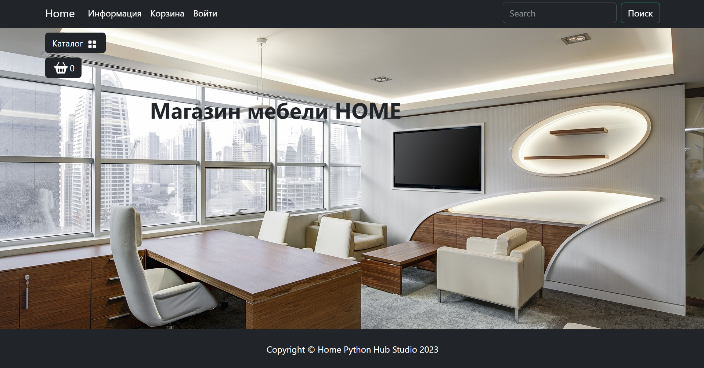
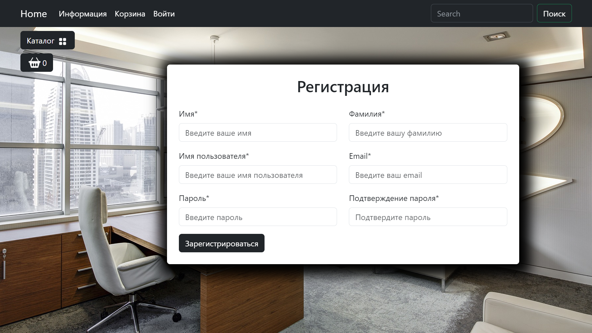
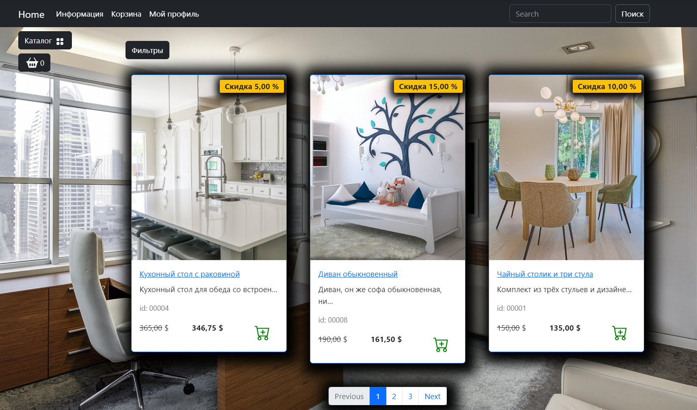
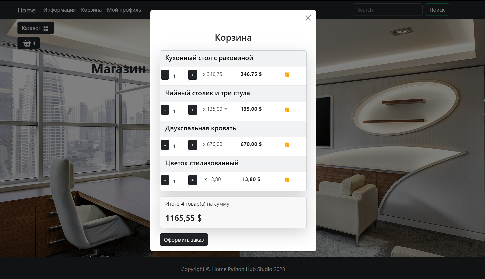
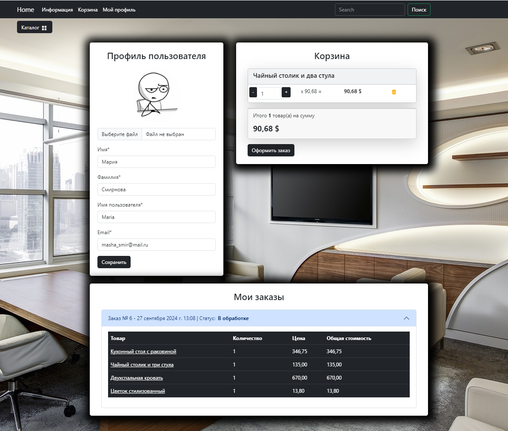

# Интернет магазин Home
### Описание проекта:

**Home** - это проект сайта онлайн магазина с мебелью.

В данном интернет магазине пользователи могут выбирать товары из каталога 
по интересующим категориям, сортировать их в зависимости от выбранных фильтров 
+ доступен полнотекстовый поиск. Понравившиеся товары можно добавить в корзину 
для дальнейшего оформления заказа. Так же у пользователя есть свой личный 
кабинет, в котором отображается информация профиля, а так же корзина и детали заказа.


### Стек технологий:

- Python
- backend: Django
- frontend: JavaScript, HTML
- PostgreSQL

### Как запустить проект:

<br>1. Клонировать репозиторий и перейти в него в командной строке:

```
git clone "адрес клонируемого репозитория"
```

<br>2. Cоздать и активировать виртуальное окружение:

```
python -m venv venv
```

* Если у вас Linux/macOS

    ```
    source venv/bin/activate
    ```

* Если у вас windows

    ```
    source venv/scripts/activate
    ```

<br>3. Установить и обновить пакетный менеджер:

```
python -m pip install --upgrade pip
```

<br>4. Установить зависимости из файла requirements.txt:

```
pip install -r requirements.txt
```

<br>5. Перейти в каталоге **app_store**(где находится файл manage.py) и 
выполнить миграции:

```
python manage.py migrate
```
```
python manage.py makemigrations
```

<br>6. Выполнить загрузку данных в базу данных:

```
python manage.py dumpdata goods.Categories > fixtures/goods/categories.json
```
```
python manage.py dumpdata goods.Products > fixtures/goods/products.json
```

<br>7. Запустить проект:

```
python manage.py runserver
```

### Project's preview:

* **Главная страница**
  
    

* **Страница регистрации**
 
    

* **Каталог товаров**
  
    

* **Корзина пользователя**

    

* **Личный кабинет пользователя**
  Личный кабинет пользователя с корзиной и оформленными заказами.

    

### Автор проекта:

Семёнова Юлия (GitHub: JuliSem)